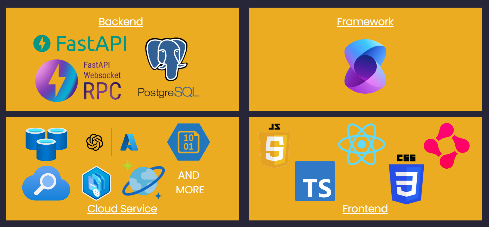

# DeepStudy — Virtual Classrooms, Real Mastery


## 🤯 Problem Statement

**251 million.** That's the staggering number of children and youth currently out of school worldwide (UNESCO). In low-income countries, 1 in 3 children lacks access to education — **a stark reminder that quality learning remains a privilege, not a right.**

Our research (40+ parent/student interviews and 60+ academic papers) reveals a critical divide: students from disadvantaged backgrounds miss three key pillars of effective learning — ***personalized instruction*, *peer collaboration*, and *targeted weakness analysis*.** Studies prove that methods incorporating these elements (e.g., peer-driven feedback) **double test score improvements** compared to passive "watch-and-answer" models.

Yet 90% of existing AI tutors perpetuate outdated, one-way teaching — overwhelming students with information rather than fostering active thinking. This gap perpetuates inequality and wastes the potential of millions.

**DeepStudy challenges this status quo.** Powered by **Azure AI services, AI agents, and Semantic Kernel**, our platform recreates authentic classroom dynamics through three core innovations: personalized teaching, intelligent peer collaboration, and adaptive weakness diagnostics. We're transforming education from passive memorization to active thinking — because every **student deserves cognitive tools, not just information.**

## 🤩 Features

<aside>
💡

**What makes DeepStudy different?**

</aside>

- **Authentic Classroom Dynamics**
    
    The first AI tutor to fully replicate offline learning cycles: **Teaching → Group Discussion → Reviewing → Practicing**
    
- **Socratic Teaching Method**
    
    Our Teacher Agent challenges students with guided questioning instead of direct answers, developing:
    
    **Critical thinking | Logical reasoning | Knowledge self-construction**
    
- **Multi-dimensional Peer Simulation**
    
    3 distinct agent personalities replicate real classroom diversity
    
- **Adaptive Learning Experience**
    
    Analyze students' weaknesses and conduct special exercises based on their classroom performance and lesson‘s key concepts.
    

## 💻 Architecture

### **Technical Architecture**



We used FastAPI, FastAPI WebSocket, and PostgreSQL for the backend, and Semantic Kernel as the framework. 

Thanks to the hackathon organizer — Semantic Kernel makes agent construction easy and provides a rich set of APIs. Its plug-and-play kernel functions allow us to dynamically assign tasks to agents via function calling.

For cloud services, we used Azure OpenAI, Azure Blob Storage, Azure Cosmos DB, Azure Redis Cache, Azure Document Intelligence, Azure AI Search, and many more.

### Flowchart


**Intelligent File Parsing**

- Upon uploading personal study materials, the system utilizes *Azure Document Intelligence* to parse documents.
- Our *Planner Agent* then generates a personalized curriculum outline based on both the document content and the user's learning profile.

**Stage 0: Lesson Preparation**

- The *Lesson Prep Agent* prepares teaching materials using:
    - The mini-lesson outline
    - Potentially relevant content from our built-in knowledge base
- The *Checker Agent* (modeled as an expert educator with years of experience in Socratic teaching methods) reviews and approves the final *teaching script*.

**Stage 1: Teaching**

- The *Teacher Agent* delivers instruction by strictly following the approved teaching script.
- Each teaching interaction requires the Teacher Agent to reference the script, ensuring:
    - Focused content delivery
    - Prevention of tangential discussions
    - Consistent teaching quality

**Stage 2: Group Discussion**

- Multiple specialized agents (each with distinct personalities and roles) engage the user in:
    - Group discussions
    - Peer-to-peer learning scenarios
    - Interactive knowledge application exercises

**Stage 3: Summary and Practice**

- The *Assistant Agent* generates a comprehensive learning report featuring:
    - Key course concepts review
    - Identified knowledge weaknesses
    - Personalized improvement recommendations
- Additionally, it creates customized practice materials tailored to the user's specific needs.

## 🌎 Our Impact

So far, We contacted the Senator and Subcommittee Co-Chair at the Halton District School Board in Ontario, CA, and tested the product with 60 HDSB students. Over 90% of them said the product was effective and useful, and expressed strong interest in continuing to use it in the future.

## 😀 How To Start

### Frontend:

Install dependencies

```bash
cd frontend
npm install
```

Start the development server

```bash
npm run dev
```

### Backend:

Make sure you have added your configuration in backend/app/core/[config.py](http://config.py/)

```bash
pip install -r requirements.txt
python main.py
```